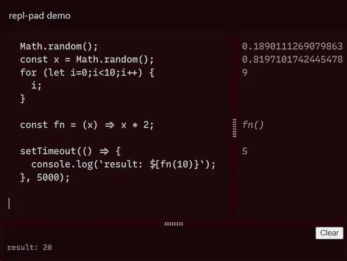
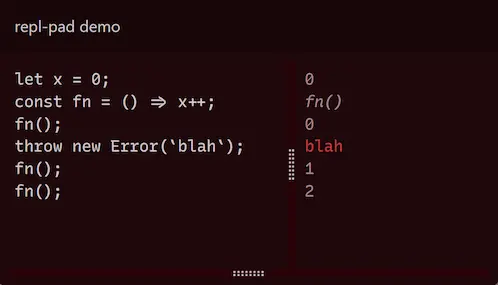
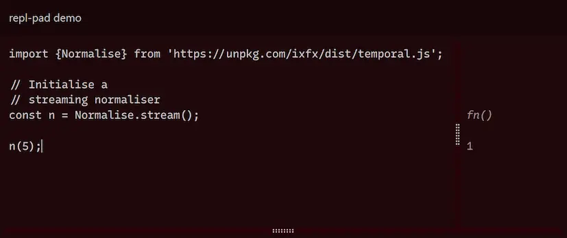
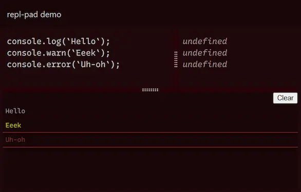

# repl-pad

Repl-pad takes some Javascript and presents it in an editable REPL-like environment. It is meant for easily making example snippets runnable and editable. [Online demo](https://clinth.github.io/repl-pad/)

From this code snippet in your HTML:
```html
<pre>
  Math.random();
  const x = Math.random();
  for (let i=0;i<10;i++) {
    i;
  }

  const fn = (x) => x * 2;

  setTimeout(() => {
    console.log(`result: ${fn(10)}`);
  }, 5000);
</pre>
```

You can produce this repl-pad, with the source magically pulled from the HTML:



Repl-pad gives the illusion that each line of code is executed independently, with the result shown to the side. But actually each line is executed along with every line that precedes it.

Statements that generate an error are skipped over optimistically:



This is so the REPL experience can be more 'sketchy', but it's worth noting that this behaviour is not how JS code is usually executed.

URL-based imports can be used as well:



Console messages are intercepted and displayed in a mini-console at the bottom of the viewport. This makes it more useful on tablet and mobile devices that lack access to DevTools.



# Caveats

Under the hood, `eval` is used, limiting the use of `async`/`await`.

`for await ... of` and `async` functions are handled by wrapping the whole snippet in this [immediately-invoked function expression](https://developer.mozilla.org/en-US/docs/Glossary/IIFE). This allows code to run, but not necessarily with the same behaviour as you'd expect.

## Examples

Before:

```
for await (...) { ... }
```

After:
```
(async () => { for await (..) { ... } })()
```

Before:
```
async function hello() {
  console.log(`hello?`);
}
hello();
```

After:
```
(async () => {
  async function hello() {
    let x = 1;
  console.log(`hello?`);
  }
  hello();
});
```

# Usage

```
npm install --save @clinth/repl-pad
```

Repl-pad is a vanilla web component. It can be used programatically, but it was meant to be hosted in a stand-alone simple HTML page. Code source comes in, base64-encoded via a URI anchor:

```
pad.html#ugly-base-64-string
```

A small helper function allows you to generate this URL automatically, from the basis of a HTML element's innerText. This is meant to convert a static code example into something runnable.

In your HTML:

```html
<pre id="eg1">
const x = 1;
</pre>
```

In your JS:

```js
import {fromInnerText} from '@clinth/repl-pad';
const el = document.getElementById(`eg1`);

// Yields: pad.html#...
const uri = fromInnerText(el, `pad.html`);

// Create an edit link and add after example
const link = document.createElement(`a`);
link.href = uri;
link.innerText = `Edit`;
el.parentNode.insertBefore(link, el.nextSibling);
```

One can add edit links for all elements that match a query.

Eg, you have HTML with:

```html
<pre>
  const x = 1;
</pre>

<pre>
  const x = Math.random();
</pre>
```

And then in JS:

```js
import {fromQuery} from '@clinth/repl-pad/link.js';
const r = fromQuery(`pre`, `pad.html`);

for (const {el, uri} of r) {
  const link = document.createElement(`a`);
  link.href = uri;
  link.innerText = `Edit`;
  el.parentNode.insertBefore(link, el.nextSibling);
}
```

See this in action in `docs/index.html`.

## Programmatic usage

It's also possible to send JS code programmatically:

```
const r = new ReplPad(`
  const x = 1;
  x;
`);
```

# Styling

See `docs/pad.html` for an example.

```
repl-pad {
  display: flex;
  flex: 1;
}
```

CSS variables:

```
--mono-font: a font family
--ui-font: a font family
--padding
```

Colours assignable via CSS variables:

```
--ui-bg
--ui-fg
--ui-pinstripe
--output
--ui-highlight-bg
--ui-highlight-fg
--console-bg
--console-fg
--console-error
--console-warn
```

# Re-evaluation

Repl-pad evaluates each line along with its preceding lines. The consequence is that some lines of code are executed several times.

eg, if we have three source lines:

```js
0 console.log(`a`);
1 console.log(`b`);
2 console.log(`c`);
```

Line #0 will be executed three times. The first time when that statement is being executed, the second to precede line #1 and the third to precede line #2. Likewise, line #1 will be executed twice. Line #2 only runs once.

This may lead to unexpected outcomes if the statement produces side-effects - like printing to the console. Here we'd see:

```
a
a
b
a
b
c
```

Repl-pad will not re-evaluate any line starting with `console.` to avoid confusion. For this reason, avoid changing anything within a `console.`:

```js
// Bad: data is changed within console. statement
console.log(i++);

// Good: console. console. statement only produces console output.
i++;
console.log(i);
```

The `reevalConsole` option can disable this default. To prevent this behaviour for other cases, consider the option `reevalUndef=false`. When set, any statement that returns undefined will be skipped over when re-evaluating.

# Options

Options can be specified as URL parameters. Eg:
`pad.html?reevalUndef=false#base-64`

Or as attributes for the web component. Eg:
```
<repl-pad reevalUndef="false" reevalConsole></repl-pad>
```

`reevalUndef` (_true/false_. default _true_)
* If true, statements that return undefined are re-evaluated. If false, they are skipped. See section above on re-evaluation.

`reevalConsole` (_true/false_. default _false_)
* If true, statements starting with `console.` are re-evaluated.

# Developing

To work on repl-pad, run a live server and open `docs` in a browser. [tsup](https://tsup.egoist.sh/) is used for building.

Build to `./dist`:

```
npm run build
```

Continually recompile to `./dist`, copying files to `docs/dist`:
```
npm run dev
```